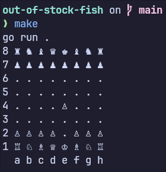

# Out Of Stock Fish
A chess engine written in go

 

## Board Representation
For the board representation I'm using 8 bitboards, 6 for the pieces and 2 for colors. 
Other than this I'm storing `WhiteToPlay` and castling rights as bits inside of `Flags` which is a `uint16`
I'm storing `EnPassantSquare` as a `uint8`. 
At last I'm storing move count `HalfMoveClock` and `FullMoveCount` as `uint16` separately.
The complete board representation takes 72 bytes with 8-byte alignment.

## Todo
- implement uci
- create legal moves generator

## WebAssembly
- https://github.com/golang/go/wiki/WebAssembly
